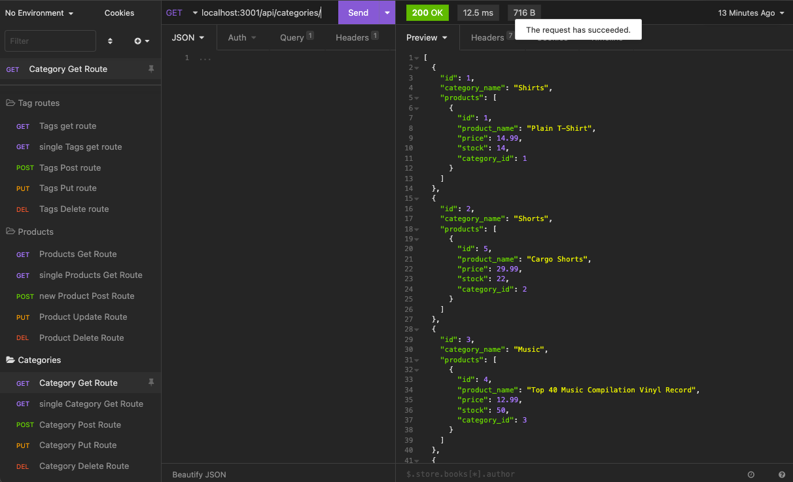
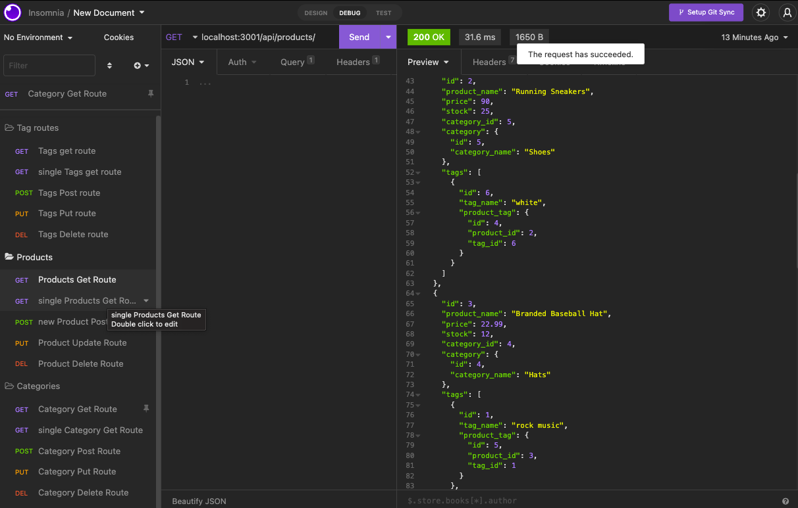
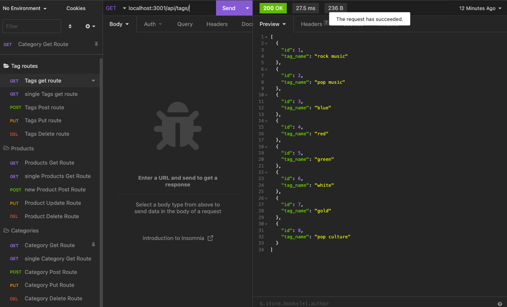

# mysql_E-commerce_backend

## Description

This Project allows a user to access the database of an E-commerce website. Using Insomnia, I was able to check that each Route was working and allowing me to read, create, edite or delete data within the ecommerce_db database. This project taught me a lot about how to create models for the data we are storing, and how to creat routes through my application. 

## Technology

Javascript, Express, MySQL2, Sequelize, dotenv, and Insomnia

## Usage

After cloning the repository onto your computer, you can open an integrated terminal and log into mysql. After logging in you can execute the schema logic using "SOURCE db/schema.sql;". This will create the data base called "ecommerce_db". After logging out of mysql, you can seed the data base using the command "npm run seed" in the terminal. Once seeded, you can start your application by using "npm start". Then we can use a data visualization app like Insomnia to view the different routes within your data base. Using Get, Post, Put, and Delete Routes you are able to use "CRUD" operations to interact with the data. "CRUD" stands for Create, Read, Update, and Delete.

<!-- Using an instance of terminal that is integrated with the index.js file the user starts the application by typing "node index". This will prompt the user with questions. The answers will be inserted into the dynamically created readme file. -->

## Link to video

https://drive.google.com/file/d/16R-4ii65L8Qi2Hp1AQSN_zh8ODsD-KfJ/view

## Screenshots
    
  

  

  
    
